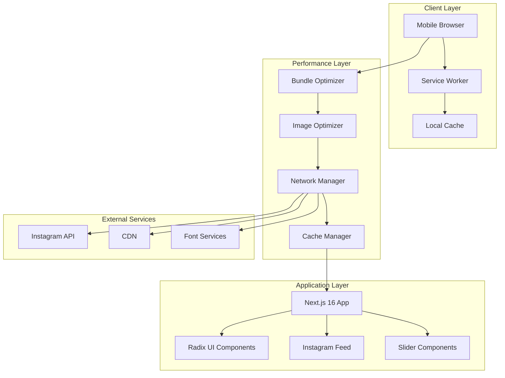
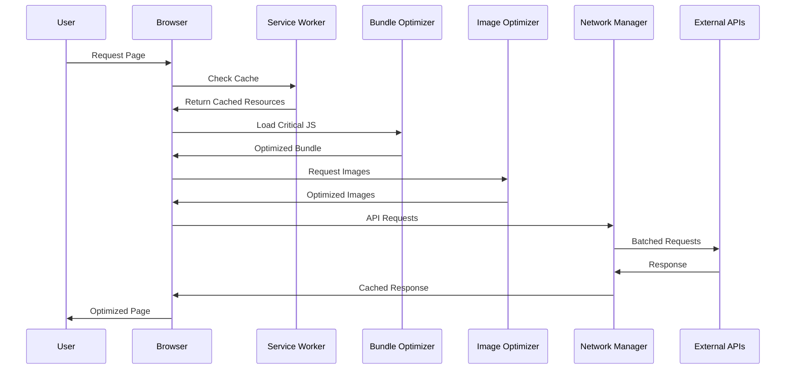

# Design Document: Petfendy Mobile Performance Optimization

## Overview

Bu tasarım, Petfendy pet otel ve taksi sitesinin mobil performansını optimize etmek için kapsamlı bir yaklaşım sunar. Mevcut Next.js 16 uygulamasının PageSpeed Insights mobil skorunu 90+ yapmak ve LCP'yi 2.5 saniye altına düşürmek için çok katmanlı optimizasyon stratejileri uygulanacak.

Temel hedefler:
- Mobil PageSpeed skorunu 90+ yapmak
- LCP'yi 2.5s altına düşürmek  
- JavaScript bundle boyutunu %40 azaltmak
- Görsel yükleme performansını %50 iyileştirmek
- Network isteklerini %30 azaltmak

## Architecture

### High-Level Architecture



### Performance Optimization Flow



## Components and Interfaces

### 1. Bundle Optimizer

**Sorumluluklar:**
- Radix UI bileşenlerinde tree shaking uygulama
- Code splitting ile sayfa bazında bundle'lar oluşturma
- Dynamic import ile lazy loading
- Bundle analizi ve boyut optimizasyonu

**Arayüzler:**
```typescript
interface BundleOptimizer {
  optimizeRadixImports(components: string[]): Promise<OptimizedBundle>
  applySplitting(routes: Route[]): Promise<SplitBundle[]>
  analyzeBundleSize(): Promise<BundleAnalysis>
  enableTreeShaking(config: TreeShakingConfig): void
}

interface OptimizedBundle {
  size: number
  chunks: BundleChunk[]
  compressionRatio: number
}
```

**Implementasyon Stratejisi:**
- Webpack Bundle Analyzer ile mevcut bundle analizi
- Next.js dynamic imports kullanarak route-based splitting
- Radix UI bileşenleri için selective imports
- Unused code elimination

### 2. Image Optimizer

**Sorumluluklar:**
- WebP format dönüşümü
- Responsive image generation
- Lazy loading implementation
- Placeholder image management

**Arayüzler:**
```typescript
interface ImageOptimizer {
  convertToWebP(imagePath: string): Promise<OptimizedImage>
  generateResponsiveImages(image: Image): Promise<ResponsiveImageSet>
  implementLazyLoading(images: Image[]): Promise<LazyLoadConfig>
  createPlaceholders(images: Image[]): Promise<PlaceholderSet>
}

interface OptimizedImage {
  webpUrl: string
  fallbackUrl: string
  size: number
  dimensions: { width: number; height: number }
}
```

**Implementasyon Stratejisi:**
- Next.js Image component ile otomatik optimizasyon
- Intersection Observer API ile lazy loading
- LQIP (Low Quality Image Placeholders) kullanımı
- CDN entegrasyonu

### 3. Network Manager

**Sorumluluklar:**
- Instagram API isteklerini cache'leme
- Batch processing uygulama
- HTTP/2 server push optimizasyonu
- Font preloading stratejisi

**Arayüzler:**
```typescript
interface NetworkManager {
  cacheApiRequests(requests: ApiRequest[]): Promise<CachedResponse[]>
  batchRequests(requests: ApiRequest[]): Promise<BatchResponse>
  preloadCriticalResources(resources: Resource[]): Promise<void>
  optimizeFontLoading(fonts: FontConfig[]): Promise<FontLoadStrategy>
}

interface CachedResponse {
  data: any
  timestamp: number
  ttl: number
  cacheKey: string
}
```

**Implementasyon Stratejisi:**
- Service Worker ile request caching
- Instagram API için intelligent batching
- Resource hints (preload, prefetch) kullanımı
- Font display: swap stratejisi

### 4. Cache Manager

**Sorumluluklar:**
- Browser cache stratejileri
- Service Worker cache yönetimi
- API response caching
- Static asset caching

**Arayüzler:**
```typescript
interface CacheManager {
  setCacheHeaders(resource: Resource): Promise<CacheHeaders>
  manageServiceWorkerCache(strategy: CacheStrategy): Promise<void>
  invalidateCache(pattern: string): Promise<void>
  getCacheStats(): Promise<CacheStatistics>
}

interface CacheStrategy {
  name: string
  pattern: RegExp
  ttl: number
  strategy: 'cache-first' | 'network-first' | 'stale-while-revalidate'
}
```

## Data Models

### Performance Metrics Model

```typescript
interface PerformanceMetrics {
  lcp: number // Largest Contentful Paint
  fid: number // First Input Delay
  cls: number // Cumulative Layout Shift
  fcp: number // First Contentful Paint
  ttfb: number // Time to First Byte
  bundleSize: number
  imageLoadTime: number
  apiResponseTime: number
  cacheHitRate: number
}
```

### Bundle Analysis Model

```typescript
interface BundleAnalysis {
  totalSize: number
  gzippedSize: number
  chunks: BundleChunk[]
  dependencies: Dependency[]
  unusedCode: UnusedCodeReport[]
}

interface BundleChunk {
  name: string
  size: number
  modules: string[]
  isAsync: boolean
}
```

### Image Optimization Model

```typescript
interface ImageOptimizationConfig {
  formats: ('webp' | 'avif' | 'jpeg' | 'png')[]
  sizes: number[]
  quality: number
  lazyLoading: boolean
  placeholder: 'blur' | 'empty' | 'data:image/svg+xml'
}
```

### Network Optimization Model

```typescript
interface NetworkOptimizationConfig {
  batchSize: number
  cacheStrategy: CacheStrategy
  preloadResources: Resource[]
  compressionLevel: number
  http2Push: boolean
}
```

## Correctness Properties

*A property is a characteristic or behavior that should hold true across all valid executions of a system-essentially, a formal statement about what the system should do. Properties serve as the bridge between human-readable specifications and machine-verifiable correctness guarantees.*

### Property Reflection

Prework analizinden sonra, redundant property'leri elimine etmek için reflection yapıldı:

**Redundancy Elimination:**
- Property 1.5 (görsel boyutu %50 azaltma) ve Property 2.4 (bundle boyutu %40 azaltma) birleştirilebilir → Genel optimizasyon property'si
- Property 5.1 (LCP 2.5s altında) ve Property 5.5 (LCP %60 iyileştirme) birleştirilebilir → LCP optimizasyon property'si  
- Property 7.1, 7.2, 7.3, 7.4 (PageSpeed metrikleri) birleştirilebilir → Core Web Vitals property'si
- Property 4.1, 4.3, 4.5 (network optimizasyonları) birleştirilebilir → Network optimization property'si

### Core Properties

**Property 1: Image Format Optimization**
*For any* image loaded in the application, the Image_Optimizer should convert it to WebP format while maintaining visual quality
**Validates: Requirements 1.1**

**Property 2: Lazy Loading Implementation**
*For any* image in the Instagram feed or slider, the Image_Optimizer should only load images that are visible in the viewport
**Validates: Requirements 1.2**

**Property 3: Responsive Image Generation**
*For any* image, the Image_Optimizer should generate multiple sizes and serve the appropriate size based on device characteristics
**Validates: Requirements 1.3**

**Property 4: Placeholder Display**
*For any* image being loaded, the Performance_System should display a placeholder until the actual image is fully loaded
**Validates: Requirements 1.4**

**Property 5: Tree Shaking Effectiveness**
*For any* Radix UI component import, the Bundle_Optimizer should only include the specific components that are actually used in the code
**Validates: Requirements 2.1**

**Property 6: Code Splitting Implementation**
*For any* JavaScript file, the Bundle_Optimizer should create separate bundles for each route to enable lazy loading
**Validates: Requirements 2.2**

**Property 7: Dynamic Import Usage**
*For any* third-party library, the Bundle_Optimizer should use dynamic imports to load them only when needed
**Validates: Requirements 2.3**

**Property 8: Render Blocking Prevention**
*For any* non-critical JavaScript, the Bundle_Optimizer should defer loading to prevent blocking page render
**Validates: Requirements 2.5**

**Property 9: GPU Acceleration Usage**
*For any* CSS animation, the Performance_System should utilize GPU acceleration through transform and opacity properties
**Validates: Requirements 3.1**

**Property 10: Critical CSS Inlining**
*For any* critical CSS, the Performance_System should inline it in the HTML to prevent render blocking
**Validates: Requirements 3.2**

**Property 11: Animation Optimization**
*For any* animation trigger, the Performance_System should optimize will-change properties and maintain 60 FPS performance
**Validates: Requirements 3.3, 3.5**

**Property 12: Unused CSS Elimination**
*For any* page load, the Performance_System should remove unused CSS to reduce bundle size
**Validates: Requirements 3.4**

**Property 13: API Request Optimization**
*For any* Instagram API call, the Network_Manager should implement caching and batch processing to reduce network overhead
**Validates: Requirements 4.1**

**Property 14: Font Loading Strategy**
*For any* font file, the Network_Manager should preload critical fonts and use font-display: swap for optimal loading
**Validates: Requirements 4.2**

**Property 15: Cache Header Configuration**
*For any* static resource, the Cache_Manager should set appropriate cache headers for optimal browser caching
**Validates: Requirements 4.4**

**Property 16: LCP Optimization**
*For any* page load, the Performance_System should achieve LCP under 2.5 seconds through resource prioritization
**Validates: Requirements 5.1, 5.2, 5.3, 5.4**

**Property 17: Internationalization Performance**
*For any* language change, the Performance_System should load only necessary translation files and complete the switch under 500ms
**Validates: Requirements 6.1, 6.2, 6.5**

**Property 18: Critical Translation Inlining**
*For any* page load, the Performance_System should inline critical translations for the default language
**Validates: Requirements 6.3**

**Property 19: Language Prefetching**
*For any* language selection, the Performance_System should prefetch other language files for faster subsequent switches
**Validates: Requirements 6.4**

**Property 20: Core Web Vitals Compliance**
*For any* page, the Performance_System should maintain PageSpeed score above 90, FID under 100ms, and CLS under 0.1
**Validates: Requirements 7.1, 7.2, 7.3, 7.4**

**Property 21: Performance Consistency**
*For any* page in the application, the Performance_System should maintain consistent performance metrics across all routes
**Validates: Requirements 7.5**

**Property 22: Real User Monitoring**
*For any* performance metric collection, the Performance_System should capture and store real user data (RUM)
**Validates: Requirements 8.1**

**Property 23: Performance Alert System**
*For any* performance issue detection, the Performance_System should automatically send alerts to the monitoring system
**Validates: Requirements 8.2**

**Property 24: Bundle Analysis Reporting**
*For any* bundle analysis, the Performance_System should report size changes and identify the source of modifications
**Validates: Requirements 8.3, 8.5**

**Property 25: Performance Dashboard Updates**
*For any* dashboard view, the Performance_System should display current performance metrics in real-time
**Validates: Requirements 8.4**

**Property 26: Overall Performance Targets**
*For any* optimization implementation, the Performance_System should achieve: 50% image size reduction, 40% bundle size reduction, and 30% network request reduction
**Validates: Requirements 1.5, 2.4, 4.5**

## Error Handling

### Bundle Optimization Errors
- **Tree Shaking Failures**: Fallback to manual import optimization
- **Code Splitting Issues**: Graceful degradation to single bundle
- **Dynamic Import Errors**: Synchronous loading fallback

### Image Optimization Errors
- **WebP Conversion Failures**: Fallback to optimized JPEG/PNG
- **Lazy Loading Issues**: Immediate loading fallback
- **Responsive Image Generation Errors**: Single optimized image fallback

### Network Optimization Errors
- **API Caching Failures**: Direct API calls without cache
- **Batch Processing Errors**: Individual request processing
- **Font Loading Issues**: System font fallback

### Performance Monitoring Errors
- **Metric Collection Failures**: Local storage backup
- **Alert System Issues**: Console logging fallback
- **Dashboard Update Errors**: Manual refresh mechanism

## Testing Strategy

### Dual Testing Approach

Bu proje hem unit testing hem de property-based testing kullanacak:

**Unit Tests:**
- Specific optimization scenarios
- Edge cases (network failures, large images, slow devices)
- Integration points between optimization components
- Error conditions and fallback mechanisms

**Property Tests:**
- Universal optimization properties across all inputs
- Performance metric validation with randomized content
- Bundle size consistency across different component combinations
- Cache behavior verification with various request patterns

**Property-Based Testing Configuration:**
- **Library**: fast-check (JavaScript/TypeScript property testing library)
- **Minimum iterations**: 100 per property test
- **Test tagging format**: **Feature: petfendy-mobile-performance, Property {number}: {property_text}**

**Testing Balance:**
- Unit tests focus on specific examples and integration scenarios
- Property tests verify universal correctness across all possible inputs
- Together they provide comprehensive coverage: unit tests catch concrete bugs, property tests verify general correctness

**Performance Testing Requirements:**
- Each correctness property must be implemented as a single property-based test
- Performance metrics must be validated in both synthetic and real-world conditions
- Bundle analysis must be automated and integrated into CI/CD pipeline
- Real User Monitoring (RUM) data must be collected and analyzed continuously