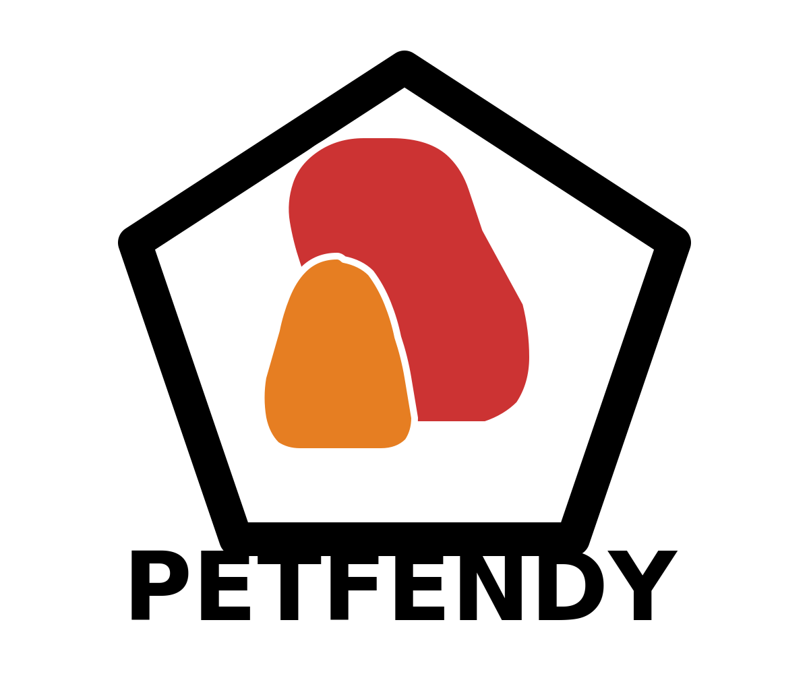

# 🐾 Petfendy - Evcil Hayvan Oteli Ve Köpek Eğitim Merkezi

## Ankara'nın Kedi, Köpek ve Evcil Hayvan Oteli



Petfendy, Ankara'da evcil hayvan sahiplerine güvenli, konforlu ve profesyonel hizmet sunan bir platformdur.

---

## 🌟 Özellikler

### 🏨 Pet Otel Rezervasyonu
- ✅ **Çok Dilli**: Türkçe ve İngilizce destek
- ✅ **Oda Seçenekleri**: Standart, Deluxe, Suite
- ✅ **Dinamik Fiyatlandırma**: Gece sayısına göre otomatik hesaplama
- ✅ **Özel İstekler**: Beslenme, ilaç, oyuncak tercihleri
- ✅ **E-posta Onayı**: Rezervasyon sonrası otomatik bilgilendirme

### 🚕 Hayvan Taksi
- ✅ **Şehir İçi/Şehirler Arası**: Mesafe bazlı fiyatlandırma
- ✅ **Gidiş-Dönüş**: İsteğe bağlı seçenek
- ✅ **Güvenli Taşıma**: Profesyonel şoförler

### 👤 Kullanıcı Yönetimi
- ✅ **E-posta Doğrulama**: 6 haneli kod ile güvenli kayıt
- ✅ **Profil Yönetimi**: Kişisel bilgiler ve güvenlik ayarları
- ✅ **Rezervasyon Geçmişi**: Tüm geçmiş rezervasyonları görüntüleme
- ✅ **Misafir Alışveriş**: Üye olmadan rezervasyon yapabilme

### 💳 Güvenli Ödeme Sistemi
- ✅ **PCI DSS Uyumlu**: Kart bilgileri asla saklanmaz
- ✅ **AES-256 Şifreleme**: Hassas veriler korunur
- ✅ **Token Sistemi**: Güvenli kart referansları
- ✅ **Luhn Algorithm**: Kart numarası doğrulama

### 🔒 Enterprise-Grade Güvenlik
- ✅ **JWT Authentication**: Güvenli oturum yönetimi
- ✅ **Bcrypt Hashing**: 12 rounds salt ile şifre koruması
- ✅ **Rate Limiting**: DDoS ve brute force koruması
- ✅ **Security Headers**: XSS, CSRF, Clickjacking koruması
- ✅ **Input Sanitization**: SQL injection önleme
- ✅ **Secure Logging**: Hassas veri loglanmaz

---

## 🚀 Kurulum

### Gereksinimler
- Node.js 18+ 
- npm veya pnpm

### Adımlar

1. **Projeyi Klonlayın**
```bash
git clone https://github.com/your-username/petfendy.com.git
cd petfendy.com
```

2. **Bağımlılıkları Yükleyin**
```bash
npm install --legacy-peer-deps
# veya
pnpm install
```

3. **Environment Variables Ayarlayın**
```bash
cp .env.example .env.local
```

`.env.local` dosyasını düzenleyip gerekli değerleri girin:
```env
# JWT Secret (openssl rand -base64 32 ile üretin)
JWT_SECRET=your-super-secret-jwt-key
JWT_REFRESH_SECRET=your-refresh-secret-key

# Encryption Key
NEXT_PUBLIC_ENCRYPTION_KEY=your-encryption-key

# Payment Gateway (İyzico, PayTR, Stripe)
PAYMENT_API_KEY=your-payment-api-key
PAYMENT_MERCHANT_ID=your-merchant-id

# Email Service (SendGrid)
SENDGRID_API_KEY=your-sendgrid-api-key
FROM_EMAIL=noreply@petfendy.com
```

4. **Geliştirme Sunucusunu Başlatın**
```bash
npm run dev
```

5. **Tarayıcıda Açın**
```
http://localhost:3000
```

---

## 📁 Proje Yapısı

```
petfendy.com/
├── app/
│   └── [locale]/           # Çok dilli sayfa yapısı
│       ├── layout.tsx      # Ana layout
│       └── page.tsx        # Ana sayfa
├── components/
│   ├── auth-context.tsx    # Kimlik doğrulama
│   ├── email-verification.tsx
│   ├── hotel-booking.tsx   # Otel rezervasyonu
│   ├── payment-modal.tsx   # Güvenli ödeme
│   ├── user-profile.tsx    # Kullanıcı profili
│   └── ui/                 # UI bileşenleri
├── lib/
│   ├── encryption.ts       # PCI DSS uyumlu şifreleme
│   ├── security.ts         # Güvenlik fonksiyonları
│   ├── payment-service-secure.ts
│   ├── email-service.ts
│   └── types.ts
├── i18n/
│   ├── messages/
│   │   ├── tr.json         # Türkçe çeviriler
│   │   └── en.json         # İngilizce çeviriler
│   └── request.ts
├── middleware.ts           # Güvenlik + i18n middleware
├── middleware-security.ts  # Rate limiting, headers
├── public/
│   └── petfendy-logo.svg   # Logo
├── SECURITY.md             # Güvenlik dokümantasyonu
└── SECURITY-SUMMARY.md     # Güvenlik özeti
```

---

## 🔐 Güvenlik

Detaylı güvenlik bilgileri için:
- [SECURITY.md](SECURITY.md) - Kapsamlı güvenlik dokümantasyonu
- [SECURITY-SUMMARY.md](SECURITY-SUMMARY.md) - Özet ve kullanım örnekleri

### Güvenlik Özellikleri
- 🔒 PCI DSS Level 1 Ready
- 🛡️ OWASP Top 10 Protected
- 🔐 AES-256 Encryption
- 🔑 JWT + Bcrypt
- 🚫 Rate Limiting (100 req/15min)
- 📊 Secure Logging

---

## 🌍 Çok Dilli Destek

Desteklenen diller:
- 🇹🇷 Türkçe (Varsayılan)
- 🇬🇧 English

Dil dosyaları: `i18n/messages/`

---

## 🧪 Test

### Test Kullanıcıları
```
Email: admin@petfendy.com
Şifre: admin123
Rol: Admin
```

### Test Kartları (Geliştirme)
```
Kart No: 4242 4242 4242 4242
Tarih: 12/30
CVV: 123
```

⚠️ **UYARI**: Production'da asla test kartları kullanmayın!

---

## 📦 Production Deployment

### Checklist
- [ ] Environment variables güvenli değerlerle ayarlandı
- [ ] HTTPS sertifikası yüklendi
- [ ] Payment gateway production keys eklendi
- [ ] Email service konfigüre edildi
- [ ] Rate limiting production values ayarlandı
- [ ] Monitoring/logging servisleri aktif
- [ ] Backup stratejisi hazır
- [ ] Security audit yapıldı

### Deployment Komutları
```bash
npm run build
npm start
```

---

## 🛠️ Teknolojiler

### Frontend
- **Next.js 16** - React framework
- **TypeScript** - Type safety
- **Tailwind CSS** - Styling
- **Shadcn/ui** - UI components
- **next-intl** - i18n

### Güvenlik
- **bcryptjs** - Password hashing
- **jsonwebtoken** - JWT authentication
- **crypto-js** - AES encryption

### Backend (Mock)
- localStorage - Geliştirme için
- Production'da: PostgreSQL + Redis önerilir

---

## 📞 İletişim

- **Website**: [petfendy.com](https://petfendy.com)
- **Email**: info@petfendy.com
- **Güvenlik**: security@petfendy.com
- **Destek**: support@petfendy.com

---

## 📄 Lisans

Copyright © 2025 Petfendy. Tüm hakları saklıdır.

---

## 🙏 Katkıda Bulunanlar

Projeye katkıda bulunmak için:
1. Fork edin
2. Feature branch oluşturun (`git checkout -b feature/amazing-feature`)
3. Commit edin (`git commit -m 'Add amazing feature'`)
4. Push edin (`git push origin feature/amazing-feature`)
5. Pull Request açın

---

**Petfendy** ile evcil hayvanlarınız güvende! 🐾

